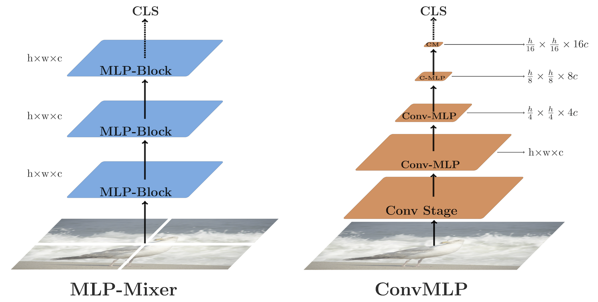

# Convolutional MLP

**ConvMLP: Hierarchical Convolutional MLPs for Vision**

Preprint will be available soon.

By [Jiachen Li<sup>[1,2]</sup>](https://chrisjuniorli.github.io/),
[Ali Hassani<sup>[1]</sup><span>&#42;</span>](https://alihassanijr.com/),
[Steven Walton<sup>[1]</sup><span>&#42;</span>](https://stevenwalton.github.io/),
and
[Humphrey Shi<sup>[1,2,3]</sup>](https://www.humphreyshi.com/)

In association with SHI Lab @ University of Oregon<sup>[1]</sup> and 
University of Illinois-Urbana Champaign<sup>[2]</sup>, and 
Picsart AI Research (PAIR)<sup>[3]</sup>




# Abstract
MLP-based architectures, which consist of a sequence of consecutive multi-layer perceptron blocks, 
have recently been found to reach comparable results to convolutional and transformer-based methods. 
However, most adopt spatial MLPs which take fixed dimension inputs, therefore making it difficult to 
apply them to downstream tasks, such as object detection and semantic segmentation. Moreover, 
single-stage designs further limit performance in other computer vision tasks and fully connected 
layers bear heavy computation. To tackle these problems, we propose ConvMLP: a hierarchical 
Convolutional MLP for visual recognition, which is a light-weight, stage-wise, co-design of 
convolution layers, and MLPs. In particular, ConvMLP-S achieves 76.8% top-1 accuracy on ImageNet-1k 
with 9M parameters and 2.4 GMACs (15% and 19% of MLP-Mixer-B/16, respectively).
Experiments on object detection and semantic segmentation further show that visual representation 
learned by ConvMLP can be seamlessly transferred and achieve competitive results with fewer parameters. 


# How to run

## Getting Started

Our base model is in pure PyTorch and Torchvision. No extra packages are required.
Please refer to [PyTorch's Getting Started](https://pytorch.org/get-started/locally/) page for detailed instructions.

You can start off with `src.convmlp`, which contains the three variants: `convmlp_s`, `convmlp_m`, `convmlp_l`:
```python3
from src.convmlp import convmlp_l, convmlp_s

model = convmlp_l(pretrained=True, progress=True)
model_sm = convmlp_s(num_classes=10)
```

## Image Classification
[timm](https://github.com/rwightman/pytorch-image-models) is recommended for image classification training 
and required for the training script provided in this repository:
```shell
./dist_classification.sh $NUM_GPUS -c $CONFIG_FILE /path/to/dataset
```

You can use our training configurations provided in `configs/classification`:
```shell
./dist_classification.sh 8 -c configs/classification/convmlp_s_imagenet.yml /path/to/ImageNet
./dist_classification.sh 8 -c configs/classification/convmlp_m_imagenet.yml /path/to/ImageNet
./dist_classification.sh 8 -c configs/classification/convmlp_l_imagenet.yml /path/to/ImageNet
```


## Object Detection
[mmdetection](https://github.com/open-mmlab/mmdetection) is recommended for object detection training
and required for the training script provided in this repository:

```shell
./dist_detection.sh $CONFIG_FILE $NUM_GPUS /path/to/dataset
```

You can use our training configurations provided in `configs/detection`:

```shell
./dist_detection.sh configs/detection/retinanet_convmlp_s_fpn_1x_coco.py 8 /path/to/COCO
./dist_detection.sh configs/detection/retinanet_convmlp_m_fpn_1x_coco.py 8 /path/to/COCO
./dist_detection.sh configs/detection/retinanet_convmlp_l_fpn_1x_coco.py 8 /path/to/COCO
```

## Object Detection & Instance Segmentation
[mmdetection](https://github.com/open-mmlab/mmdetection) is recommended for training Mask R-CNN
and required for the training script provided in this repository (same as above).

You can use our training configurations provided in `configs/detection`:

```shell
./dist_detection.sh configs/detection/maskrcnn_convmlp_s_fpn_1x_coco.py 8 /path/to/COCO
./dist_detection.sh configs/detection/maskrcnn_convmlp_m_fpn_1x_coco.py 8 /path/to/COCO
./dist_detection.sh configs/detection/maskrcnn_convmlp_l_fpn_1x_coco.py 8 /path/to/COCO
```

## Semantic Segmentation
[mmsegmentation](https://github.com/open-mmlab/mmsegmentation) is recommended for semantic segmentation training
and required for the training script provided in this repository:
```shell
./dist_segmentation.sh $CONFIG_FILE $NUM_GPUS /path/to/dataset
```

You can use our training configurations provided in `configs/segmentation`:

```shell
./dist_segmentation.sh configs/segmentation/fpn_convmlp_s_512x512_40k_ade20k.py 8 /path/to/ADE20k
./dist_segmentation.sh configs/segmentation/fpn_convmlp_m_512x512_40k_ade20k.py 8 /path/to/ADE20k
./dist_segmentation.sh configs/segmentation/fpn_convmlp_l_512x512_40k_ade20k.py 8 /path/to/ADE20k
```

# Results

## Image Classification
### ImageNet
<table style="width:100%">
    <thead>
        <tr>
            <td><b>Model</b></td> 
            <td><b>Top-1 Accuracy</b></td> 
            <td><b># Params</b></td> 
            <td><b>MACs</b></td> 
        </tr>
    </thead>
    <tbody>
        <tr>
            <td>ConvMLP-S</td>
	        <td><a href="http://ix.cs.uoregon.edu/~alih/conv-mlp/checkpoints/convmlp_s_imagenet.pth" target="_blank">76.8%</a></td>
	        <td>9.0M</td>
            <td>2.4G</td>
        </tr>
        <tr>
            <td>ConvMLP-M</td>
	        <td><a href="http://ix.cs.uoregon.edu/~alih/conv-mlp/checkpoints/convmlp_m_imagenet.pth" target="_blank">79.0%</a></td>
	        <td>17.4M</td>
            <td>3.9G</td>
        </tr>
        <tr>
            <td>ConvMLP-L</td>
	        <td><a href="http://ix.cs.uoregon.edu/~alih/conv-mlp/checkpoints/convmlp_l_imagenet.pth" target="_blank">80.2%</a></td>
	        <td>42.7M</td>
            <td>9.9G</td>
        </tr>
    </tbody>
</table>

You could also set `pretrained=True` when initializing the models to download and set these checkpoints.

## Object Detection
### Mask R-CNN
<table style="width:100%">
    <thead>
        <tr>
            <td><b>Model</b></td> 
            <td><b># Params</b></td> 
            <td><b>AP<sup>b</sup></b></td> 
            <td><b>AP<sup>b</sup><sub>50</sub></b></td> 
            <td><b>AP<sup>b</sup><sub>75</sub></b></td>
            <td><b>Checkpoint</b></td> 
        </tr>
    </thead>
    <tbody>
        <tr>
            <td>ConvMLP-S</td>
	        <td>28.7M</td>
	        <td>38.4</td>
	        <td>59.8</td>
	        <td>41.8</td>
            <td><a href="http://ix.cs.uoregon.edu/~alih/conv-mlp/checkpoints/detection/maskrcnn_convmlp_s_coco.pth" target="_blank">Download</a>
        </tr>
        <tr>
            <td>ConvMLP-M</td>
	        <td>37.1M</td>
	        <td>40.6</td>
	        <td>61.7</td>
	        <td>44.5</td>
            <td><a href="http://ix.cs.uoregon.edu/~alih/conv-mlp/checkpoints/detection/maskrcnn_convmlp_m_coco.pth" target="_blank">Download</a>
        </tr>
        <tr>
            <td>ConvMLP-L</td>
	        <td>62.2M</td>
	        <td>41.7</td>
	        <td>62.8</td>
	        <td>45.5</td>
            <td><a href="http://ix.cs.uoregon.edu/~alih/conv-mlp/checkpoints/detection/maskrcnn_convmlp_l_coco.pth" target="_blank">Download</a>
        </tr>
    </tbody>
</table>

### RetinaNet
<table style="width:100%">
    <thead>
        <tr>
            <td><b>Model</b></td> 
            <td><b># Params</b></td> 
            <td><b>AP<sup>b</sup></b></td> 
            <td><b>AP<sup>b</sup><sub>50</sub></b></td> 
            <td><b>AP<sup>b</sup><sub>75</sub></b></td> 
            <td><b>AP<sup>b</sup><sub>S</sub></b></td> 
            <td><b>AP<sup>b</sup><sub>M</sub></b></td> 
            <td><b>AP<sup>b</sup><sub>L</sub></b></td> 
            <td><b>Checkpoint</b></td> 
        </tr>
    </thead>
    <tbody>
        <tr>
            <td>ConvMLP-S</td>
	        <td>18.7M</td>
	        <td>37.2</td>
	        <td>56.4</td>
	        <td>39.8</td>
	        <td>20.1</td>
	        <td>40.7</td>
	        <td>50.4</td>
            <td><a href="http://ix.cs.uoregon.edu/~alih/conv-mlp/checkpoints/detection/retinanet_convmlp_s_coco.pth" target="_blank">Download</a>
        </tr>
        <tr>
            <td>ConvMLP-M</td>
	        <td>27.1M</td>
	        <td>39.4</td>
	        <td>58.7</td>
	        <td>42.0</td>
	        <td>21.5</td>
	        <td>43.2</td>
	        <td>52.5</td>
            <td><a href="http://ix.cs.uoregon.edu/~alih/conv-mlp/checkpoints/detection/retinanet_convmlp_m_coco.pth" target="_blank">Download</a>
        </tr>
        <tr>
            <td>ConvMLP-L</td>
	        <td>52.9M</td>
	        <td>40.2</td>
	        <td>59.3</td>
	        <td>43.3</td>
	        <td>23.5</td>
	        <td>43.8</td>
	        <td>53.3</td>
            <td><a href="http://ix.cs.uoregon.edu/~alih/conv-mlp/checkpoints/detection/retinanet_convmlp_l_coco.pth" target="_blank">Download</a>
        </tr>
    </tbody>
</table>

## Instance Segmentation
### Mask R-CNN
<table style="width:100%">
    <thead>
        <tr>
            <td><b>Model</b></td> 
            <td><b># Params</b></td>
            <td><b>AP<sup>m</sup></b></td> 
            <td><b>AP<sup>m</sup><sub>50</sub></b></td> 
            <td><b>AP<sup>m</sup><sub>75</sub></b></td> 
            <td><b>Checkpoint</b></td> 
        </tr>
    </thead>
    <tbody>
        <tr>
            <td>ConvMLP-S</td>
	        <td>28.7M</td>
	        <td>35.7</td>
	        <td>56.7</td>
	        <td>38.2</td>
            <td><a href="http://ix.cs.uoregon.edu/~alih/conv-mlp/checkpoints/detection/maskrcnn_convmlp_s_coco.pth" target="_blank">Download</a>
        </tr>
        <tr>
            <td>ConvMLP-M</td>
	        <td>37.1M</td>
	        <td>37.2</td>
	        <td>58.8</td>
	        <td>39.8</td>
            <td><a href="http://ix.cs.uoregon.edu/~alih/conv-mlp/checkpoints/detection/maskrcnn_convmlp_m_coco.pth" target="_blank">Download</a>
        </tr>
        <tr>
            <td>ConvMLP-L</td>
	        <td>62.2M</td>
	        <td>38.2</td>
	        <td>59.9</td>
	        <td>41.1</td>
            <td><a href="http://ix.cs.uoregon.edu/~alih/conv-mlp/checkpoints/detection/maskrcnn_convmlp_l_coco.pth" target="_blank">Download</a>
        </tr>
    </tbody>
</table>

## Semantic Segmentation
<table style="width:100%">
    <thead>
        <tr>
            <td><b>Model</b></td> 
            <td><b># Params</b></td> 
            <td><b>mIoU</b></td>
            <td><b>Checkpoint</b></td> 
        </tr>
    </thead>
    <tbody>
        <tr>
            <td>ConvMLP-S</td>
	        <td>12.8M</td>
            <td>35.8</td>
            <td><a href="http://ix.cs.uoregon.edu/~alih/conv-mlp/checkpoints/segmentation/sem_fpn_convmlp_s_ade20k.pth" target="_blank">Download</a>
        </tr>
        <tr>
            <td>ConvMLP-M</td>
	        <td>21.1M</td>
            <td>38.6</td>
            <td><a href="http://ix.cs.uoregon.edu/~alih/conv-mlp/checkpoints/segmentation/sem_fpn_convmlp_m_ade20k.pth" target="_blank">Download</a>
        </tr>
        <tr>
            <td>ConvMLP-L</td>
	        <td>46.3M</td>
            <td>40.0</td>
            <td><a href="http://ix.cs.uoregon.edu/~alih/conv-mlp/checkpoints/segmentation/sem_fpn_convmlp_l_ade20k.pth" target="_blank">Download</a>
        </tr>
    </tbody>
</table>

## Transfer
<table style="width:100%">
    <thead>
        <tr>
            <td><b>Dataset</b></td> 
            <td><b>Model</b></td> 
            <td><b>Top-1 Accuracy</b></td> 
            <td><b># Params</b></td>
        </tr>
    </thead>
    <tbody>
        <tr>
            <td rowspan="3">CIFAR-10</td>
            <td>ConvMLP-S</td>
	        <td><a href="http://ix.cs.uoregon.edu/~alih/conv-mlp/checkpoints/convmlp_s_cifar10.pth" target="_blank">98.0%</a></td>
	        <td>8.51M</td>
        </tr>
        <tr>
            <td>ConvMLP-M</td>
	        <td><a href="http://ix.cs.uoregon.edu/~alih/conv-mlp/checkpoints/convmlp_m_cifar10.pth" target="_blank">98.6%</a></td>
	        <td>16.90M</td>
        </tr>
        <tr>
            <td>ConvMLP-L</td>
	        <td><a href="http://ix.cs.uoregon.edu/~alih/conv-mlp/checkpoints/convmlp_l_cifar10.pth" target="_blank">98.6%</a></td>
	        <td>41.97M</td>
        </tr>
        <tr>
            <td rowspan="3">CIFAR-100</td>
            <td>ConvMLP-S</td>
	        <td><a href="http://ix.cs.uoregon.edu/~alih/conv-mlp/checkpoints/convmlp_s_cifar100.pth" target="_blank">87.4%</a></td>
	        <td>8.56M</td>
        </tr>
        <tr>
            <td>ConvMLP-M</td>
	        <td><a href="http://ix.cs.uoregon.edu/~alih/conv-mlp/checkpoints/convmlp_m_cifar100.pth" target="_blank">89.1%</a></td>
	        <td>16.95M</td>
        </tr>
        <tr>
            <td>ConvMLP-L</td>
	        <td><a href="http://ix.cs.uoregon.edu/~alih/conv-mlp/checkpoints/convmlp_l_cifar100.pth" target="_blank">88.6%</a></td>
	        <td>42.04M</td>
        </tr>
        <tr>
            <td rowspan="3">Flowers-102</td>
            <td>ConvMLP-S</td>
	        <td><a href="http://ix.cs.uoregon.edu/~alih/conv-mlp/checkpoints/convmlp_s_flowers102.pth" target="_blank">99.5%</a></td>
	        <td>8.56M</td>
        </tr>
        <tr>
            <td>ConvMLP-M</td>
	        <td><a href="http://ix.cs.uoregon.edu/~alih/conv-mlp/checkpoints/convmlp_m_flowers102.pth" target="_blank">99.5%</a></td>
	        <td>16.95M</td>
        </tr>
        <tr>
            <td>ConvMLP-L</td>
	        <td><a href="http://ix.cs.uoregon.edu/~alih/conv-mlp/checkpoints/convmlp_l_flowers102.pth" target="_blank">99.5%</a></td>
	        <td>42.04M</td>
        </tr>
    </tbody>
</table>


# Citation
```bibtex
@article{li2021convmlp,
	title        = {ConvMLP: Hierarchical Convolutional MLPs for Vision},
	author       = {Jiachen Li and Ali Hassani and Steven Walton and Humphrey Shi},
	year         = 2021
}
```
